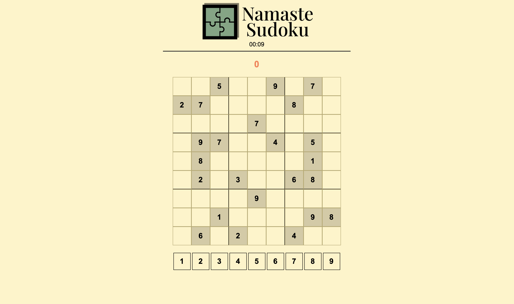

# Sudoku Solver Project

## Overview

This JavaScript-based Sudoku solver project employs functions, arrays, and looping structures to efficiently solve 9x9 Sudoku puzzles. The solver follows a logical approach to deduce and fill in missing values within the puzzle grid.

## Project Goals

The primary goals of this project are:

1. Provide an efficient and logical Sudoku solver.
2. Represent the puzzle state and solution in a structured manner.
3. Offer easy interpretation of column and row values within the puzzle.

## Technologies Used

- **JavaScript:** The solver is implemented in JavaScript for its versatility and browser compatibility.

## How to Run the Project

To run the project, follow these steps:

1. Open the project folder in your preferred code editor.
2. Run the main JavaScript file (e.g., `sudoku.js`) using a JavaScript runtime or a web browser console.

## Acknowledgments

- This project is inspired by a puzzle from a Sudoku book (pg. 51).
- Big thanks to YouTube channel, Kenny Yip Coding: https://www.youtube.com/watch?v=S4uRtTb8U-U&t=984s.
- Thanks to the Sudoku community for insights into solving strategies and puzzle representations.

## Notes

- The Sudoku solver is implemented in JavaScript.
- The `board` array represents the initial state of the puzzle.
- The `solution` array provides the solution to the Sudoku puzzle.

Feel free to explore and use the solver for solving other Sudoku puzzles.
<<<<<<< HEAD

=======
>>>>>>> 3f9d213898cbc8202c66cbae8274774362daa701
